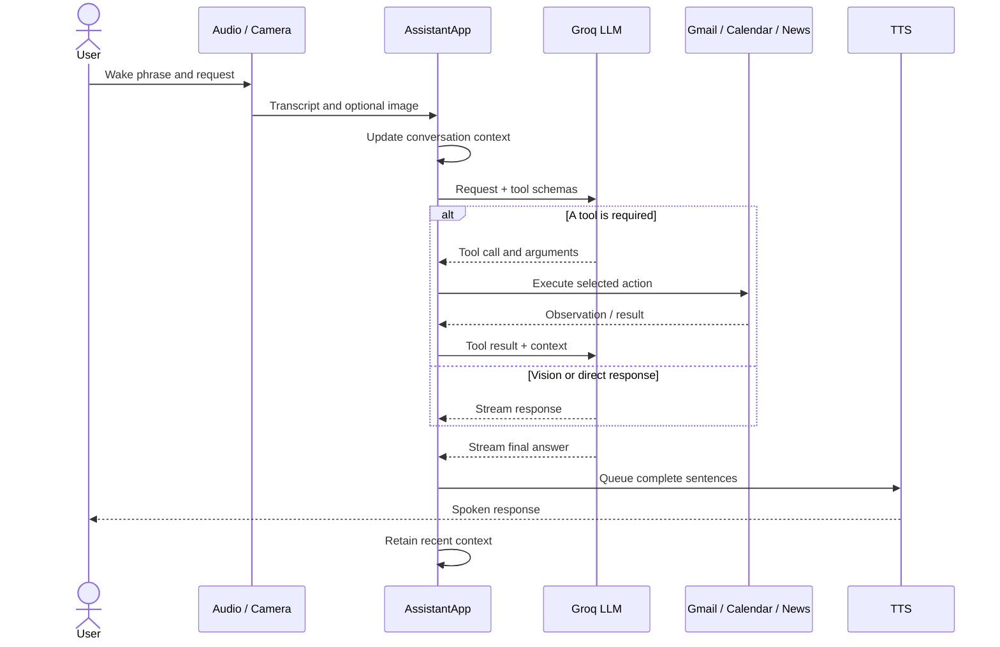
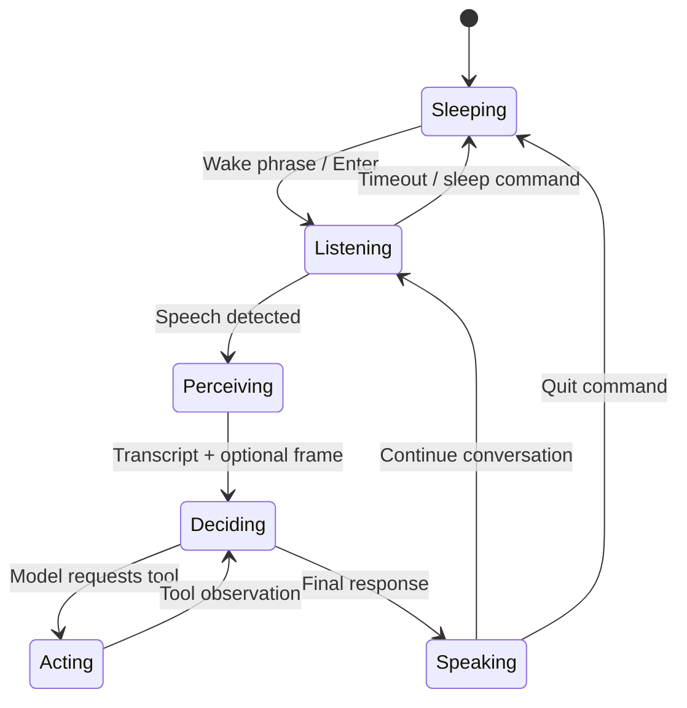

# ASPIRE

ASPIRE is a voice-first, vision-capable AI assistant intended for smart-glasses-style use. It listens for a wake phrase, transcribes speech, optionally captures a camera frame, lets a Groq-hosted language model select external tools, and speaks the streamed answer aloud.

> [!NOTE]
> The current audio and desktop commands use macOS utilities (`say`, `afplay`, and `open`). The Python dependencies are portable, but Windows and Linux need equivalent text-to-speech, sound, and file-opening adapters.

## Features

- Wake phrase or Enter-key activation
- In-memory microphone recording and Google speech recognition
- Voice-only and camera-assisted vision modes
- Streaming Groq responses with sentence-level text-to-speech
- Gmail reading and sending through Google OAuth
- Google Calendar lookup and event creation
- NewsAPI headline retrieval
- Short rolling conversation memory

## Agentic loop

The assistant uses a perceive–decide–act–observe loop. In voice mode the model can request a tool, receive its result, and then formulate the final response. In vision mode the captured image is sent directly with the user's request.



The core control flow can also be viewed as a state machine:



## Prerequisites

- Python 3.10 or newer
- macOS for the current speech/chime implementation
- A working microphone and, for vision mode, a webcam
- A Groq API key and NewsAPI key
- A Google Cloud OAuth desktop client with Gmail API and Google Calendar API enabled

On macOS, PortAudio may be needed before installing the audio packages:

```bash
brew install portaudio
```

## Setup

1. Create and activate a virtual environment:

   ```bash
   python3 -m venv .venv
   source .venv/bin/activate
   ```

2. Install dependencies:

   ```bash
   python -m pip install --upgrade pip
   pip install -r requirements.txt
   ```

3. Create local environment configuration:

   ```bash
   cp .env.example .env
   ```

   Add valid values for `GROQ_API_KEY` and `NEWS_API_KEY` in `.env`.

4. Download the Google OAuth desktop-client secret from Google Cloud, rename it to `credentials.json`, and place it in the project root. On first launch, ASPIRE opens the OAuth consent flow and creates a local `token.json`.

5. Start the assistant:

   ```bash
   python ASPIRE.py
   ```

Both Google credential files and `.env` are excluded from Git.

## Usage

- Say “wake up” or press Enter to begin.
- Say “start vision” to attach a camera frame to subsequent requests.
- Say “start voice” or “stop vision” to return to voice-only mode.
- Say “sleep”, “quit”, “bye”, or “shut down” to end the active conversation.
- Press `Ctrl+C` to stop the process.

Examples include “Read my latest unread emails,” “What is on my calendar?”, “What am I looking at?”, and “Give me the latest technology headlines.” Email sending and calendar creation perform real external actions, so review the spoken request carefully.

## Project layout

```text
ASPIRE/
├── ASPIRE.py          # Assistant, integrations, and agent loop
├── requirements.txt   # Python runtime dependencies
├── .env.example       # Environment-variable template
├── .gitignore         # Local secrets, caches, and generated files
└── README.md           # Setup, architecture, and usage
```

## Security notes

- Never commit `.env`, `credentials.json`, or `token.json`.
- If an API key was previously embedded in the source or committed, revoke and rotate it; removing it from the latest file does not remove it from Git history.
- Google OAuth requests Gmail modification and Calendar access. Use a test account while developing if possible.

## Known limitations

- Platform-specific audio and TTS commands currently target macOS.
- Speech recognition uses Google's online recognizer and therefore requires internet access.
- Camera selection, audio thresholds, and capture resolution are fixed in code.
- The integrations initialize eagerly at startup, so missing credentials prevent normal operation.
